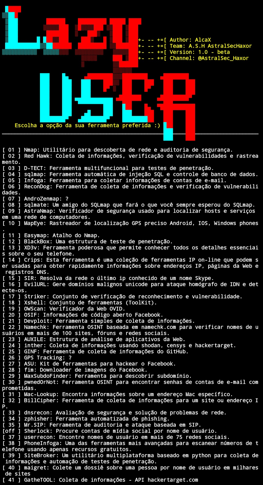
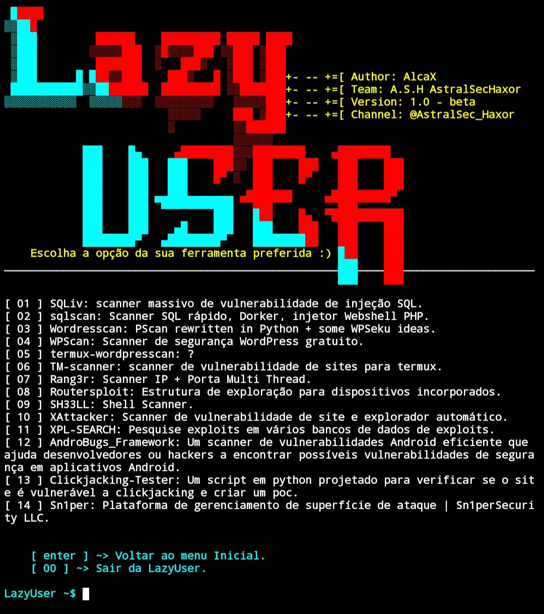

# LazyUser

## em desenvolvimento


## Descrição
LazyUser é uma ferramenta que facilitará o seu dia a dia. Seu objetivo é ajudar você a instalar e usar diversas ferramentas de testes de penetração e hacking no sistema *Android* com facilidade. Ela permite que os usuários instalem e utilizem facilmente uma variedade de ferramentas populares, como *Nmap, Gobuster, SQLMap, MetaSploit, Hash Identify, etc*. 
O LazyScript é fácil e simples de usar, bastando digitar um comando para instalar e utilizar qualquer uma das ferramentas.
## aviso
A LazyScript foi desenvolvida para o público ético, a ferramenta pode ser muito útil para descobertas e tarefas de hacking ético. 

# comandos de instalação nas plataformas:
• Debian
• Ubuntu
• Kali Linux
• ParrotOs
• Emulador Termux
```
apt-get update && apt-get upgrade
pkg install python -y
pkg install git -y
git clone https://github.com/AstralSecHaxor/LazyUser/
cd LazyUser
chmod +x install.sh
python lazyuser.py
```
 Ser você estive pelo • Termux 
 •Aviso: Utilize esses comandos para evitar erros inesperados antes da execução do script.
 
 Exemplo:
```         termux-chroot
         unset LD_PRELOAD 
```
## Menu inicial.


## Categoria [ 01 ] Coletar de informações.


## categoria [ 02 ] Análise de vulnerabilidades.
