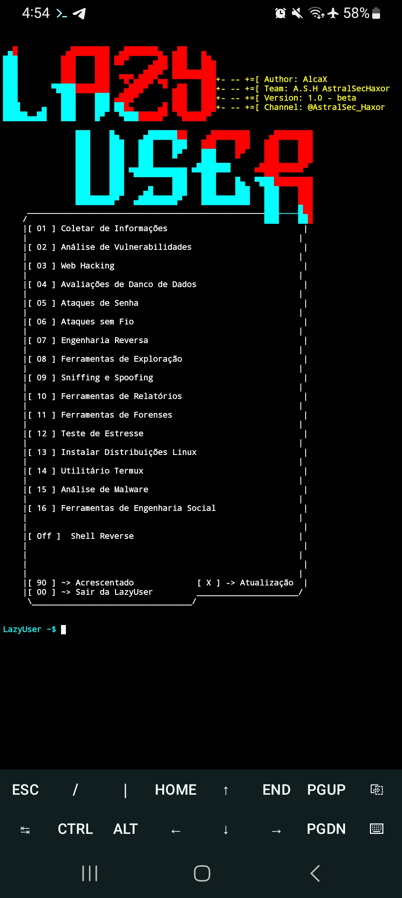

# LazyUser

## Descrição
LazyScript é uma ferramenta que facilitará o seu dia a dia. Seu objetivo é ajudar você a instalar e usar diversas ferramentas de testes de penetração e hacking no sistema *Android* com facilidade. Ela permite que os usuários instalem e utilizem facilmente uma variedade de ferramentas populares, como *Nmap, Gobuster, SQLMap, MetaSploit, Hash Identify, etc*. 
O LazyScript é fácil e simples de usar, bastando digitar um comando para instalar e utilizar qualquer uma das ferramentas.
## aviso
A LazyScript foi desenvolvida para o público ético, a ferramenta pode ser muito útil para descobertas e tarefas de hacking ético. 

# Instalação no emulador de terminal Termux.

apt update && pkg upgrade -y
pkg install python -y
pkg install git -y
git clone https://github.com/AstralSecHaxor/LazyScript
cd LazyScript
python lazyscript.py

## Menu inicial

## Categoria [ a ] Coletar de informações
